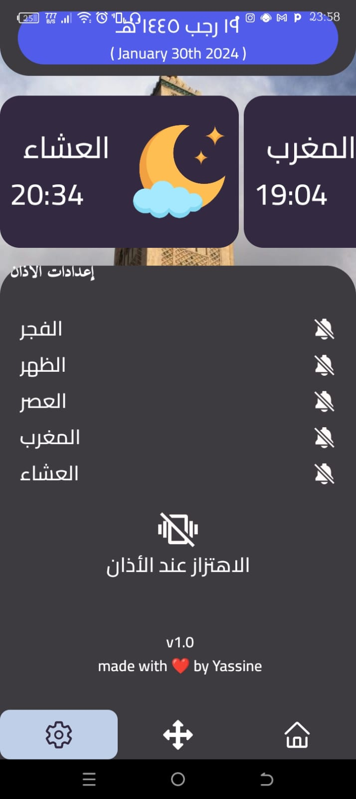
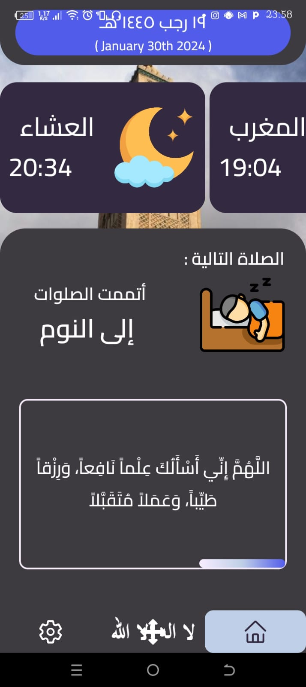

# Multazim App Readme

## Overview

**Multazim** is a mobile application designed to help users determine the direction of the Qibla (the direction of the Kaaba in Mecca) using the device's compass and location services. This app is particularly useful for Muslims who need to know the Qibla direction for performing prayers.

## Thumbnail

### Developer Information

- **Developer:** Yassine ait elhardouf
- **App Name:** Multazim
- **Version:** 1.0

## Screenshots

  
  
  

## Features

- **Qibla Direction:** The app calculates and displays the Qibla direction based on the user's location.
- **Compass Integration:** Utilizes the device's magnetometer to provide an accurate direction indicator.
- **Modern UI:** The app features a clean and user-friendly interface.

## Dependencies

- **@expo/webpack-config:** ^19.0.0
- **@react-native-async-storage/async-storage:** 1.18.2
- **@react-navigation/bottom-tabs:** ^6.5.11
- **@react-navigation/native:** ^6.1.9
- **@react-navigation/native-stack:** ^6.9.17
- **@react-navigation/stack:** ^6.3.20
- **@reduxjs/toolkit:** ^2.0.1
- **adhan:** ^4.4.3
- **expo:** ~49.0.15
- **expo-av:** ~13.4.1
- **expo-background-fetch:** ~11.3.0
- **expo-blur:** ~12.4.1
- **expo-constants:** ~14.4.2
- **expo-font:** ~11.4.0
- **expo-haptics:** ~12.4.0
- **expo-linear-gradient:** ~12.3.0
- **expo-linking:** ~5.0.2
- **expo-location:** ~16.1.0
- **expo-notifications:** ~0.20.1
- **expo-router:** ^2.0.0
- **expo-sensors:** ~12.3.0
- **expo-sqlite:** ~11.3.3
- **expo-status-bar:** ~1.6.0
- **expo-task-manager:** ~11.3.0
- **hijri-converter:** ^1.1.1
- **moment:** ^2.30.1
- **moment-hijri:** ^2.1.2
- **react:** 18.2.0
- **react-dom:** 18.2.0
- **react-native:** 0.72.5
- **react-native-geolocation-service:** ^5.3.1
- **react-native-safe-area-context:** 4.6.3
- **react-native-screens:** ~3.22.0
- **react-native-sensors:** ^7.3.6
- **react-native-sqlite-storage:** ^6.0.1
- **react-native-system-setting:** ^1.7.6
- **react-native-volume-manager:** ^1.10.0
- **react-native-web:** ~0.19.6
- **react-navigation:** ^4.4.4
- **react-navigation-stack:** ^2.10.4
- **react-navigation-tabs:** ^2.11.2
- **react-redux:** ^9.1.0

## Getting Started

1. Install Node.js and Expo CLI.
2. Clone the repository.
3. Run `npm install` to install dependencies.
4. Run `expo start` to start the development server.
5. Open the Expo Go app on your mobile device and scan the QR code to run the app.

## Usage

1. Allow location permissions when prompted.
2. The app will calculate and display the Qibla direction based on your location.
3. Use the compass indicator to align with the Qibla direction for prayers.

## Support and Issues

If you encounter any issues or have suggestions for improvement, please [open an issue](https://github.com/yourusername/multazim-app/issues) on GitHub.

## License

This project is licensed under the MIT License - see the [LICENSE](LICENSE) file for details.
